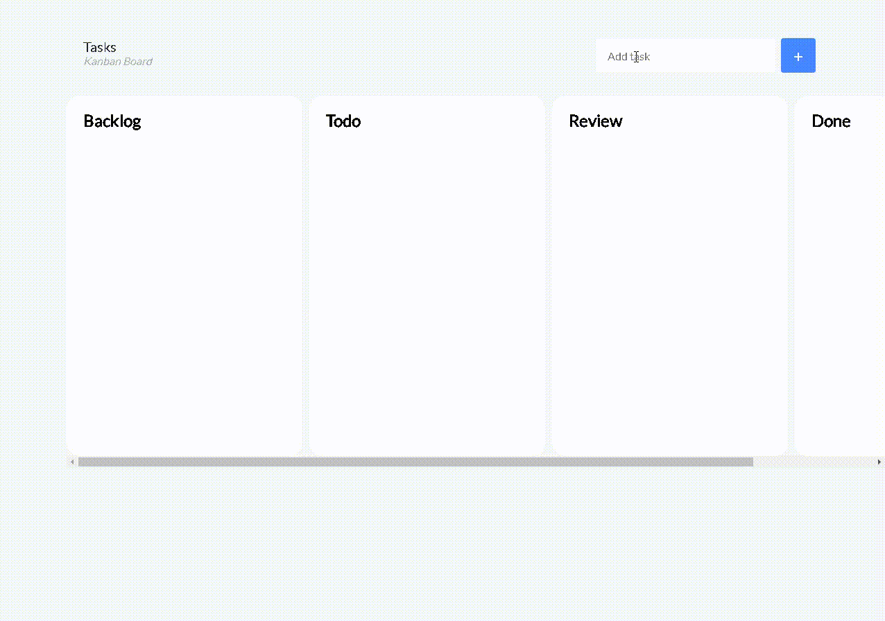

<h1 align="center">
    
</h1>

## :movie_camera: Preview

## :clipboard: About the project

This weekend I was studying about kanban and I saw that you have several tools with the kanban board (previously I had just created the Trello layout) so it came to my mind: "Why not, create a simple web application to use kanban ?"

## :bookmark_tabs: How to use

- Add a task and it will appear in the backlog stingray
- After adding, just drag and drop to other stingrays as you complete each step

## :computer: Used languages

The cool thing is that this project only use HTML, CSS and Vanilla JS

## :book: License

This project is under the MIT license. See the [LICENSE](LICENSE.md) for more details.